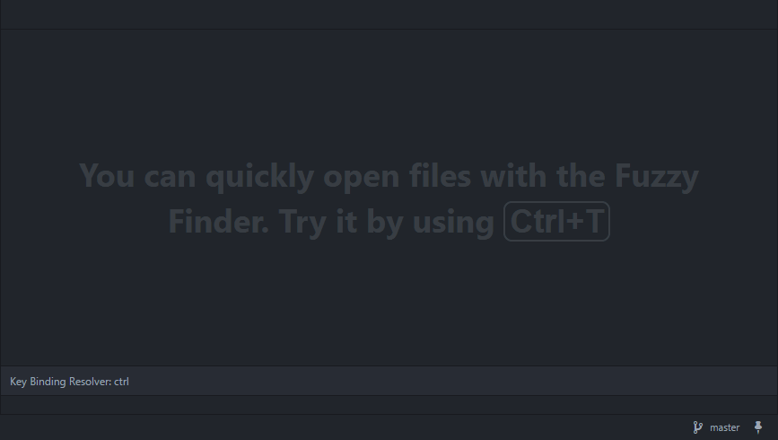

# Scratch

A simple scratchpad implementation for Github's [Atom](http://atom.io)

## Description
* Press <code>Ctrl + Alt + ,</code> to open/close the scratch file.
* The scratch file is saved by default in *~/.atom/scratch*, but you can change the path and the filename in the package configuration
